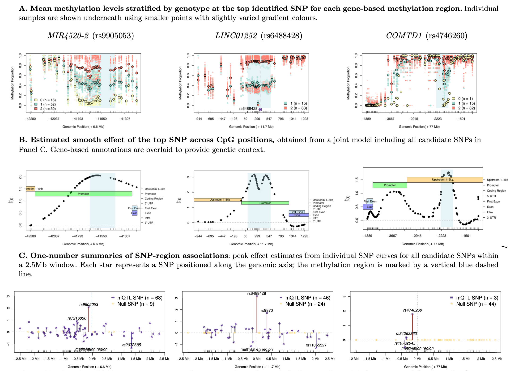
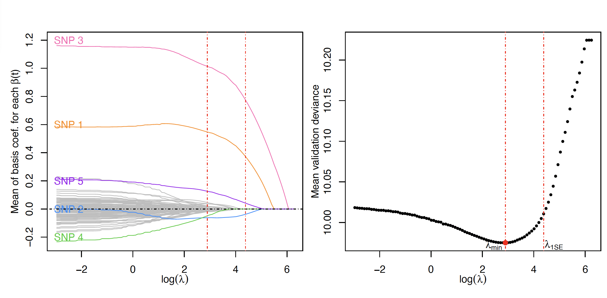

# sparseSOMNiBUS

**Sparse Smooth Omnibus Model for Regional DNA Methylation QTL Mapping**

`sparseSOMNiBUS` is an R package for identifying **regional methylation QTLs (mQTLs)** using high-resolution bisulfite sequencing data.  
It implements the statistical method proposed in Zhao *et al.* (*Biostatistics*, 2025), which models associations between local SNPs and CpG methylation levels within genomic regions through sparsity-controlled, smoothly varying coefficient functions.

---

## 🔍 Overview

The figure below illustrates the `sparseSOMNiBUS` analysis pipeline, showing:
1. Mean methylation patterns by genotype at top SNPs,  
2. Smooth estimated SNP effects across CpG positions,  
3. Summary of SNP–region associations across candidate variants.

  

---

## ⚙️ Key Features

- **Joint regional modeling** of all CpGs and SNPs within a genomic region  
- **Sparse functional coefficients** estimated via penalized likelihood with a sparsity-smoothness pently
- **Variable selection and effect estimation** for SNP–region associations (mQTL mapping)  
- **Biologically interpretable** smooth effects across CpG sites  

---

## 📈 Model fitting and tuning parameter selection

`sparseSOMNiBUS` fits a penalized regression model that balances **model smoothness** and **sparsity** through the tuning parameters *λ* (penalty strength) and *α* (mixing parameter).
The penalty encourages sparse, smoothly varying effects across CpG sites, allowing only a subset of SNPs to exhibit nonzero functional influence.

To select *λ*, the package uses **K-fold cross-validation** and evaluates the **mean validation deviance** over a grid of candidate λ values.
Two commonly used selection rules are implemented:

- **λ_min** — the value of λ that minimizes the mean validation deviance;  
- **λ_1SE** — the largest λ within one standard error of the minimum, providing a more parsimonious model.

  

*Figure: Example of penalized regression tuning in `sparseSOMNiBUS`.  
Cross-validation selects the optimal λ via the minimum mean deviance (λ_min) and the 1-SE rule (λ_1SE)*

---

## 📄 Citation

If you use sparseSOMNiBUS in your research, please cite the following paper:

Zhao K, Yang AY, Oualkacha K, Zeng Y, Klein K, Hudson M, Colmegna I, Bernatsky S, Greenwood CMT.
A novel high-dimensional model for identifying regional DNA methylation QTLs.
Biostatistics, Volume 26, Issue 1, 2025, kxaf032.
https://doi.org/10.1093/biostatistics/kxaf032
